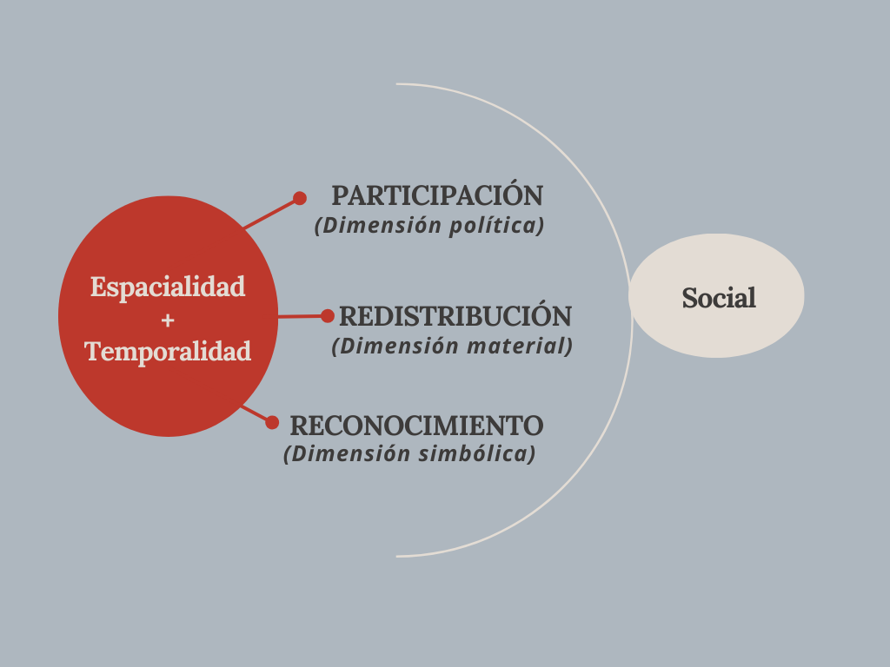

## {data-background-color="#BF382C"}


:::: {.columns .v-center-container}
::: {.column width=5%}
:::
::: {.column width=95%}
## [**Justicia espacial: Una aproximación desde una perspectiva tridimensional de la justicia**]{.white}

------------------------------------------------------------------------

[María Fernanda Núñez]{.black}  
[Departamento de Sociología, Universidad de Chile]{.black}  <br>
[**4° Coloquio de Tesistas del Magíster en Ciencias Sociales**]{.black} <br>
[14 de agosto de 2026]{.black}
:::
::::

<span class="bloque"></span>


<div style="text-align: center;">
  
  
</div>


# [Antecedentes]{.white} {data-background-color="#44322F"}

## {data-background-color="#AEB7BF"}

:::: columns

::: {.column width="35%"}
**Producción** conceptual como un objeto de estudio (Latour, 1992): 

- Discutir el uso de la noción de justicia en las temáticas asociadas al espacio,  para así entender cómo se conceptualiza <span style="color: #BF382C;"><strong>*lo justo*</strong>.
:::

::: {.column width="10%"}
:::

::: {.column width="55%"}
Uso empírico de la justicia desde un ***enfoque evaluativo*** (Morange y Quentin, 2018):

> <span style="color: #BF382C;"><strong> Los estudios urbanos críticos se caracterizan por no definir explícitamente los supuestos normativos de la crítica que realizan</strong>
:::
::::


## [**¿Qué entendemos por *Justicia?***]{.black} {data-background-color="#AEB7BF"}

:::: columns

::: {.column width="50%"}
- Justicia Espacial (Soja, 2010)

- Dimensiones de la justicia (Fraser, 2008)

> Situación en que las dinámicas espaciales cumplen con el ejercicio pleno del criterio de la paridad participativa.
:::

::: {.column width="50%"}

:::

::::


## [ <span style="color: #44322F;"><strong>Pregunta: <br> <br> </strong></span
<br> ***¿Cómo se investiga la justicia espacial en los estudios urbanos chilenos publicados desde 2014 hasta la actualidad?***]{.white} {data-background-color="#BF382C"}


# [Metodología]{.white} {data-background-color="#44322F"}


 

## <span style="color: #BF382C;"><strong>PRISMA - Criterios de inclusión </strong></span
<br>  {data-background-color="#AEB7BF"}


```{=html}
<table style="width:100%; border-collapse: collapse; font-size: 0.75em;">
  <tr>
    <td colspan="2" style="background:#e0e0e0; font-weight:bold; border:1px solid #333; padding:8px;">
      Identificación
    </td>
  </tr>
  <tr>
    <td colspan="2" style="border:1px solid #333; padding:8px;">
      Artículos de 2 revistas urbanas chilenas indexadas
    </td>
  </tr>
  <tr>
    <td style="background:#e0e0e0; font-weight:bold; border:1px solid #333; padding:8px; width:50%;">
      Selección
    </td>
    <td style="background:#e0e0e0; font-weight:bold; border:1px solid #333; padding:8px; width:50%;">
      Excluidos
    </td>
  </tr>
  <tr>
    <td style="border:1px solid #333; padding:8px; vertical-align:top;">
      <ul style="margin:0; padding-left:1.1em;">
        <li>Estudian contexto urbano chileno</li>
        <li>2014-2025</li>
      </ul>
    </td>
    <td style="border:1px solid #333; padding:8px; vertical-align:top;">
      <ul style="margin:0; padding-left:1.1em;">
        <li>Estudian contexto urbano regional u de otro país distinto a Chile</li>
        <li>Números anteriores a 2014</li>
      </ul>
    </td>
  </tr>
  <tr>
    <td colspan="2" style="background:#e0e0e0; font-weight:bold; border:1px solid #333; padding:8px;">
      Incluidos
    </td>
  </tr>
  <tr>
    <td colspan="2" style="border:1px solid #333; padding:8px;">
      184 artículos
    </td>
  </tr>
</table>
```

## [**Web Scraping**]{.black} {data-background-color="#AEB7BF"}


- Paquetes: **`rvest`** y **`httr`** 
- Estructura de las bases de datos: 

```{r}
#| echo: false
#| warning: false
#| message: false
library(dplyr)
df_urb  <- read.csv("urbanismo_chile_filtrado_detalle.csv", stringsAsFactors = FALSE)

df_urb <- select(df_urb, id,url,anio,num,titulo,abstract=var1,palabras_claves=var2,url_pdf)

```


```{r}
#| echo: false
#| #| warning: false
#| message: false
library(dplyr)
library(gt)

df_urb %>% 
  head(2) %>% 
  gt() %>% 
  tab_options(
    table.font.size = px(9),
   # heading.title.font.size = px(18),
    column_labels.font.weight = "bold",
    column_labels.background.color = "#e0e0e0"
  )
```

# [<span style="color: #BF382C;"><strong>**Objetivo 1:**</strong></span
<br>  Fenómenos espaciales]{.black}

## [Paquete **`bibliometrix`**]{.black} {data-background-color="#AEB7BF"}

- **Red de co-ocurrencias** a partir de las palabras clave del artículo 

- **Léxico** 


## {background-image="red.png" background-size="contain"}

## [Próximamente]{.black}

### [<span style="color: #BF382C;"><strong>**Objetivo 1:**</strong></span
<br>  Fenómenos espaciales]{.black}
- Usar otras herramientas para afinar la identificación de los fenómenos mediante el uso de embeddings: **`BERTopic`**
  - **Semántico** 

### [ <span style="color: #BF382C;"><strong>**Objetivo 2:**</strong></span
<br> Dimensiones]{.black}

- **Modelo keyATM** y selección de diez artículos con mayor probabilidad de asociarse a cada una de las tres dimensiones (se trabajará con una muestra final de 30 documentos) 

### [<span style="color: #BF382C;"><strong>**Objetivo 3:**</strong></span
<br> Interpretación ]{.black}
-  Análisis cualitativo de **meta-interpretación** (Weed, 2005)

 

## {data-background-color="#BF382C"}


:::: {.columns .v-center-container}
::: {.column width=5%}
:::
::: {.column width=95%}
## [**Justicia espacial: Una aproximación desde una perspectiva tridimensional de la justicia**]{.white}

------------------------------------------------------------------------

[María Fernanda Núñez]{.black}  
[Departamento de Sociología, Universidad de Chile]{.black}  <br>
[**4° Coloquio de Tesistas del Magíster en Ciencias Sociales**]{.black} <br>
[14 de agosto de 2026]{.black}
:::
::::

<span class="bloque"></span>


<div style="text-align: center;">
  
  
</div>
