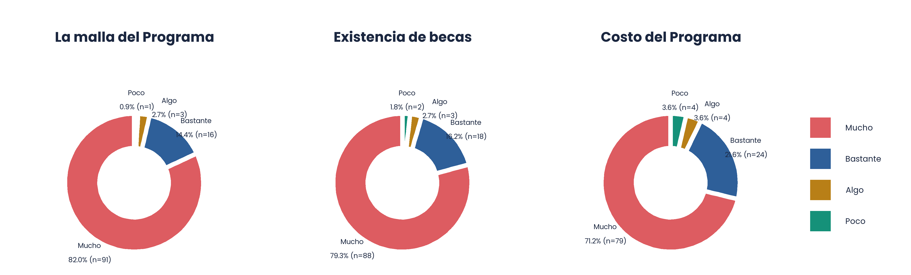
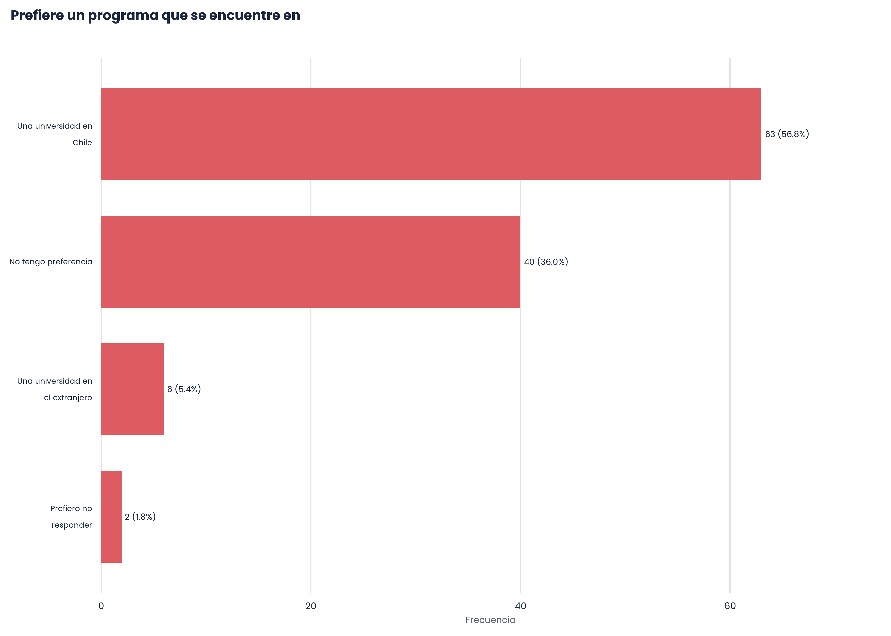
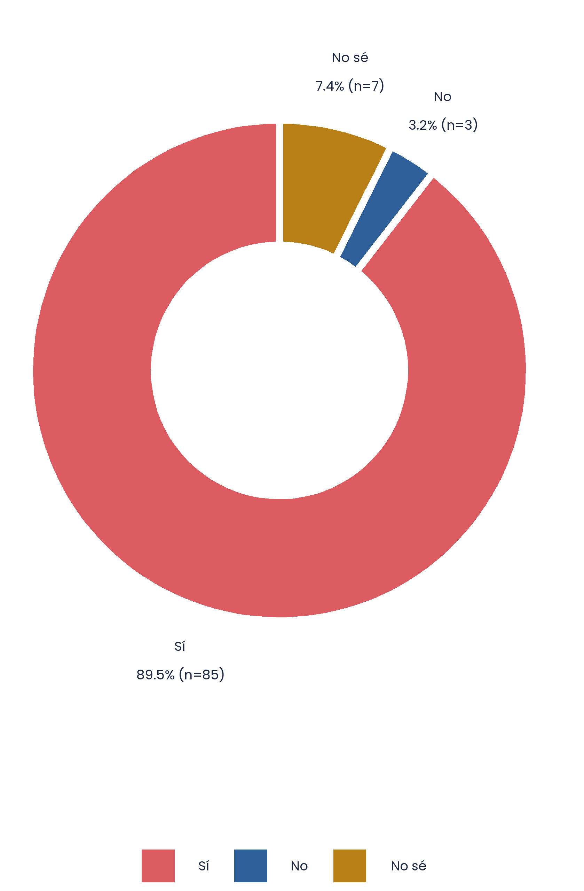

## {data-background-color="#1B2740"}

:::: columns
::: {.column width="20%"}

:::

::: {.column .column-right width="80%"}  
 

# [**Resultados de la Encuesta:   <strong>Estudio de Demanda DEG</strong>**]{.white}

------------------------------------------------------------------------

-- de septiembre de 2026
:::
::::

## [Índice]{.white} {data-background-color="#1B2740"}

:::: columns
::: {.column width="50%"}
1. Demanda

1.1 ¿Qué características se esperan de un programa de Posgrado?
 
 
1.2 ¿Qué características se esperan de un programa de Doctorado?

:::

::: {.column width="50%"}
2. Propuesta 

2.1 ¿Cuánto interes genera la propuesta?
 
 
2.2 ¿A quienes les interesa la propuesta? 
 
 
2.3 Caracteristicas de la propuesta
:::
::::

# <strong> 1. ¿Cuál es la demanda para un Doctorado en Estudios de Género?</strong> {data-background-color="#1B2740"}

##

###     De las 161 personas encuestadas, **147 (91.30%) cree que es importante** contar con un posgrado en Estudios de Género.     Mientras que solo **111 (68.94%) esta interesada en estudiar** un posgrado en Estudios de Género.

# <strong>1.1 ¿Qué características se esperan de un programa de *Posgrado*?</strong> {data-background-color="#DD5C61"} 

## 

#### <strong>Aspectos importantes para seleccionar un programa:</strong> <strong>La malla se posiciona como el aspecto más importante (82%)</strong>

Mientras que el prestigio del cuerpo académico del programa (68.5%), la existencia de colaboraciones interdisciplinarias (64%) y el prestigio de la universidad (55.9%) presentan menor relevancia. 

## 

#### <strong>Localidad del programa:</strong> <strong>El 56,8% prefiere un programa ubicado en una universidad en Chile</strong>

:::: columns
::: {.column width="70%"}

:::
::: {.column width="30%"}

 De quienes contestaron preferir estudiar en Chile, no tenían preferencia o prefirieron no responder, 100 personas **sí elegirían la Universidad de Chile** para realizar estudios de posgrado.  

:::
::::

##  

#### <strong>Quiénes prefieren estudiar en la </strong> <mark style="background-color: #DD5C61;color: white;"> UChile</mark>

::: {.panel-tabset}

#### Género

#### Edad

#### Residencia: Chile

#### Residencia: Regiones, Chile

#### Residencia: Comunas RM, Chile

#### Residencia: País

#### Nivel educacional

#### Año de egreso

#### Ocupación

:::

##

#### <strong>Razones por las que se prefiere estudiar en la </strong> <mark style="background-color: #DD5C61;color: white;"> UChile</mark>

- El prestigio de la universidad (81%)
- Me interesa trabajar con alguien o equipo de la institución (41%)
- Me manejo bien en el idioma en que se dicta (32%)
- Me permite estar cerca de mi familia o red de apoyo (31%)
- Me resulta más accesible económicamente (26%)
- Me conviene por mi trabajo actual (14%) 

##

- quienes valoran el prestigio de la univerisdad
edad promedio de 37 años 
grafico residencia en chile, las 7 personas que noresiden en el pais consideran esta razon importnate para elegir la uchile. Indicar nacionalidades
grafico nivel educacional 

- a quienes permite estar cerca de sus redes
- en que trabajan quienes les conviene por su trabajo actual 

# <strong>1.2 ¿Qué características se esperan de un programa de *Doctorado*?</strong> {data-background-color="#DD5C61"}  

##
aspectos

motivaciones (+ cruce con quienes les interesa la uchile)

##
elementos 

## 
tematicas 
cruce por genero

# <strong> 2. Propuesta de programa</strong> {data-background-color="#1B2740"}

# <strong>2.1 ¿Cuánto interes genera la propuesta?</strong> {data-background-color="#DD5C61"} 

##

::: columns
::: {.column width="50%"}
::: {.callout-note title="Características del programa" icon=false}

- Formará investigadores(as) para la realización de contribuciones a los Estudios de Género como disciplina y a la agenda social a través del estudio original y autónomo de problemáticas sociales relacionadas con género.

- Pocas vacantes en el programa permitirán una formación personalizada, con apoyo de pares y de académicos(as) especializados(as) en líneas de investigación de relevancia para los estudios de género.

- Foco en desarrollo de proyecto e investigación original para el desarrollo de una tesis doctoral que sea un aporte y que genere un impacto en los Estudios de Género.

- Cuatro años de duración
:::
:::

::: {.column width="50%"}

:::
:::

# <strong>2.2 ¿A quienes les interesa la propuesta?</strong> {data-background-color="#DD5C61"} 

##

#### <strong> Mujeres, de x años, ... </strong>

::: {.panel-tabset}

#### Género

#### Edad

#### Residencia: Chile

#### Residencia: Regiones, Chile

#### Residencia: Comunas RM, Chile

#### Residencia: País

#### Nivel educacional

#### Año de egreso

#### Ocupación

:::

# <strong>2.3 Características de la propuesta</strong> {data-background-color="#DD5C61"}  

## 
comentarios relevantes 

## 

Link al reporte completo 
