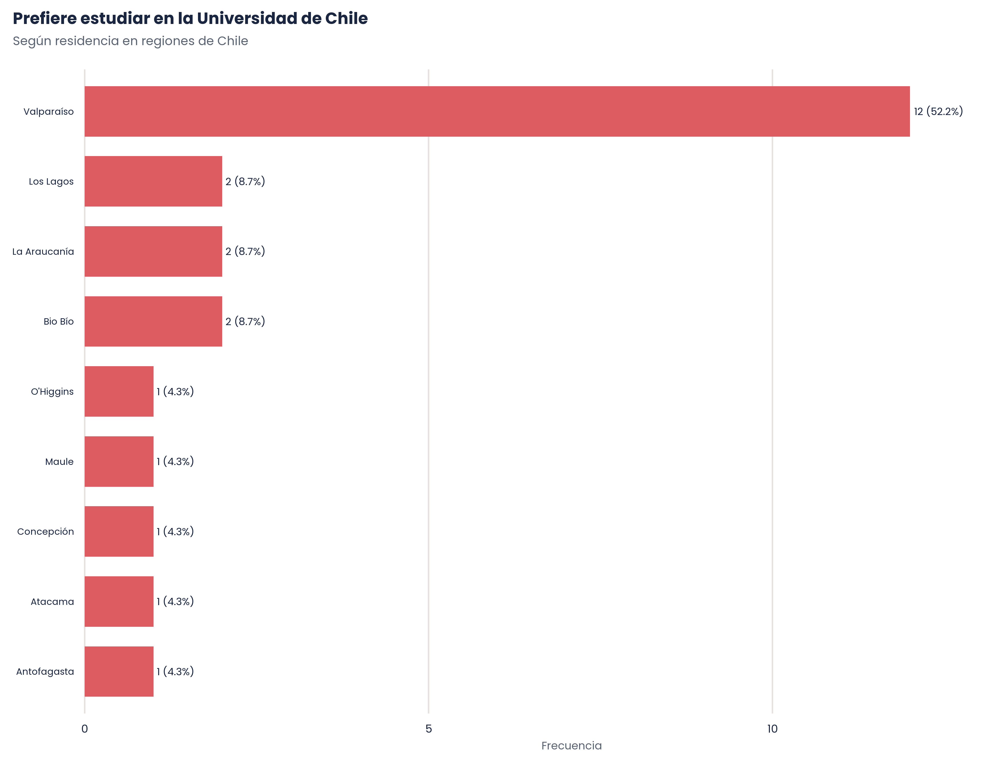
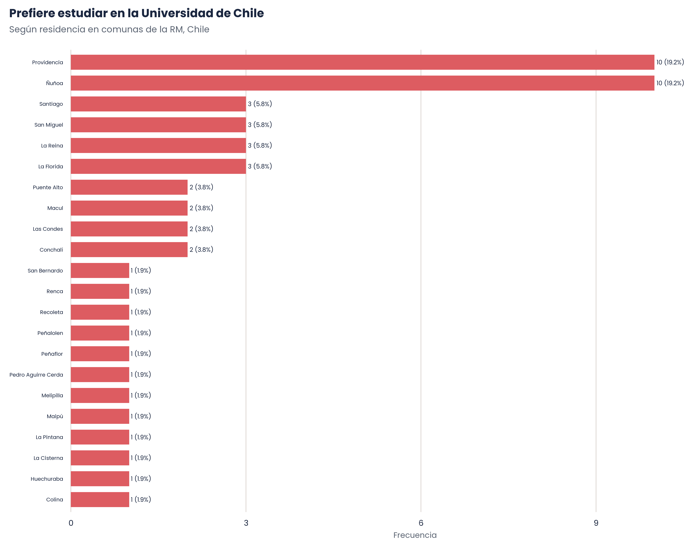
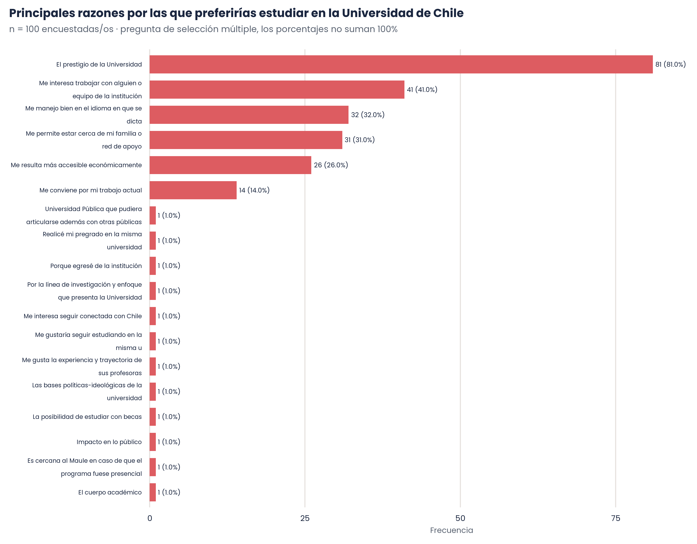
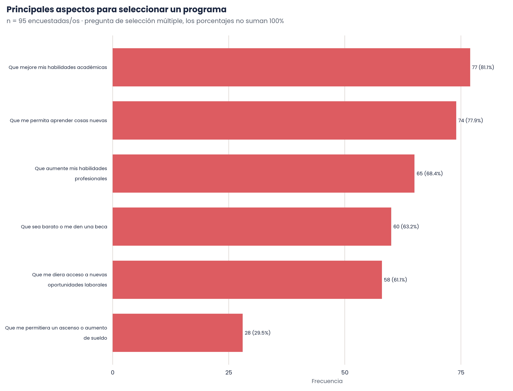
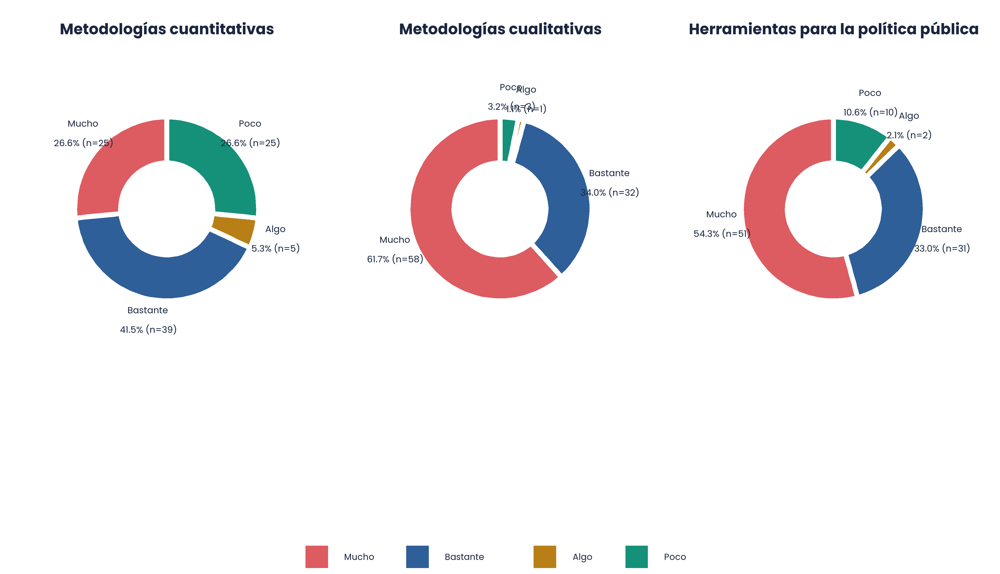
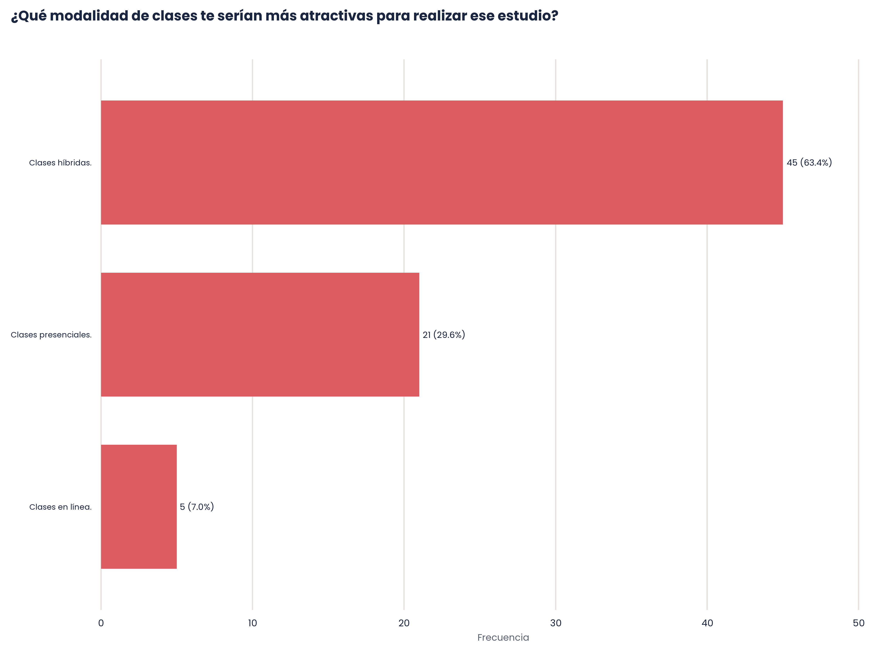

## {data-background-color="#1B2740"}

:::: columns
::: {.column width="20%"}

:::

::: {.column .column-right width="80%"}  
 

# [**Resultados de la Encuesta:   <strong>Estudio de Demanda DEG</strong>**]{.white}

------------------------------------------------------------------------

23 de septiembre de 2026
:::
::::

## [Índice]{.white} {data-background-color="#1B2740"}

:::: columns
::: {.column width="50%"}
1. Demanda

1.1 ¿Qué características se esperan de un programa de Posgrado?
 
 
1.2 ¿Qué características se esperan de un programa de Doctorado?

:::

::: {.column width="50%"}
2. Propuesta 

2.1 ¿Cuánto interés genera la propuesta?
 
 
2.2 ¿A quiénes les interesa la propuesta? 
 
 
2.3 Características de la propuesta
:::
::::

# <strong> 1. ¿Cuál es la demanda para un Doctorado en Estudios de Género?</strong> {data-background-color="#1B2740"}

##

###     De las 161 personas encuestadas, **147 (91.30%) cree que es importante** contar con un posgrado en Estudios de Género.     Mientras que solo **111 (68.94%) esta interesada en estudiar** un posgrado en Estudios de Género.

# <strong>1.1 ¿Qué características se esperan de un programa de *Posgrado*?</strong> {data-background-color="#DD5C61"} 

## 

#### <strong>Aspectos importantes para seleccionar un programa:</strong> <strong>La malla se posiciona como el aspecto más importante (82%)</strong>

Mientras que el prestigio del cuerpo académico del programa (68.5%), la existencia de colaboraciones interdisciplinarias (64%) y el prestigio de la universidad (55.9%) presentan menor relevancia. 

## 

#### <strong>Localidad del programa:</strong> <strong>El 56,8% prefiere un programa ubicado en una universidad en Chile</strong>

:::: columns
::: {.column width="70%"}

:::
::: {.column width="30%"}

 De quienes contestaron preferir estudiar en Chile, no tenían preferencia o prefirieron no responder, 100 personas **sí elegirían la Universidad de Chile** para realizar estudios de posgrado.  

:::
::::

##  

#### <strong>Quiénes prefieren estudiar en la </strong> <mark style="background-color: #DD5C61;color: white;"> UChile:</mark>  <strong>De las 100 personas, 82 son mujeres, tienen, en promedio, 38 años y **88 residen en Chile**</strong>

##  

#### <strong>Quiénes prefieren estudiar en la </strong> <mark style="background-color: #DD5C61;color: white;"> UChile:</mark>   <strong>52 residen en la RM</strong>

##  

#### <strong>Quiénes prefieren estudiar en la </strong> <mark style="background-color: #DD5C61;color: white;"> UChile:</mark>      <strong>43 cuentan con estudios de Magíster</strong>, 36 con título/licenciatura, 14 con estudios de Doctorado y 7 con educación media completa. Con un promedio de año de egreso: 2018.      <strong>42 trabajan en una Universidad</strong>, 19 no trabajan, 10 trabajan en el Estado o Municipalidad y 9 en alguna empresa privada.      Mientras que 12 residen en el extranjero: 4 en **Ecuador**, 3 en **Argentina**, 2 en **España**, 1 en **Sudáfrica**, 1 em **Italia** y 1 en **Colombia** 

##

#### <strong>Razones por las que se prefiere estudiar en la </strong> <mark style="background-color: #DD5C61;color: white;"> UChile</mark>

# <strong>1.2 ¿Qué características se esperan de un programa de *Doctorado*?</strong> {data-background-color="#DD5C61"}  

##

:::: columns
::: {.column width="75%"}

:::

::: {.column width="25%"}

##### <strong>Motivación principal por la que le interesaía estudiar un programa:</strong> <strong>Desarrollar una agenda de investigación propia (42.1%) y actualizarse en debates actuales en los Estudios de Género (34.7%)</strong>
:::
::::

##
#### <strong>Elementos que debería privilegiar el programa en sus cursos:</strong> <strong>Las perspectivas teóricas de género se posicionan como el elemento que debería privilegiarse mucho (82.1%)</strong>
 

## 
#### <strong>Temáticas que deberían ser abordadas por los cursos:</strong> <strong> Enfoques críticos en teoría feminista y de género (81.1%), Políticas públicas de género (73.7%) y Epistemologias feministas (71.6%) son las tres temáticas más mencionadas  </strong>

Seguidas por: 

| Tema                                            | N  | %     |
|:------------------------------------------------|---:|------:|
| Género, sexualidades y diversidades             | 63 | 66.3% |
| Cambios sociales y género                       | 57 | 60.0% |
| Trabajo, economía y cuidados                    | 57 | 60.0% |
| Violencias de género                            | 56 | 58.9% |
| Decolonialidad                                  | 55 | 57.9% |
| Género, educación y producción de conocimientos | 54 | 56.8% |
| Educación no sexista y justicia social          | 53 | 55.8% |

# <strong> 2. Propuesta de programa</strong> {data-background-color="#1B2740"}

# <strong>2.1 ¿Cuánto interés genera la propuesta?</strong> {data-background-color="#DD5C61"} 

##

::: columns
::: {.column width="50%"}
::: {.callout-note title="Características del programa" icon=false}

- Formará investigadores(as) para la realización de contribuciones a los Estudios de Género como disciplina y a la agenda social a través del estudio original y autónomo de problemáticas sociales relacionadas con género.

- Pocas vacantes en el programa permitirán una formación personalizada, con apoyo de pares y de académicos(as) especializados(as) en líneas de investigación de relevancia para los estudios de género.

- Foco en desarrollo de proyecto e investigación original para el desarrollo de una tesis doctoral que sea un aporte y que genere un impacto en los Estudios de Género.

- Cuatro años de duración
:::
:::

::: {.column width="50%"}

:::
:::

# <strong>2.2 ¿A quiénes les interesa la propuesta?</strong> {data-background-color="#DD5C61"} 

##

###  **Mujeres** (85.9%), de una edad promedio de **36** **años**, residentes en **Chile** (88.2%), mayoritariamente en las comunas de **Providencia** (23.9%) y **Ñuñoa** (17.4%), con estudios de **Magíster** (51.8%), egresadas, en promedio, en el año **2019** y que actualmente trabajan vinculadas a una **universidad** (42.4%).      Mientras que quienes residen en el extranjero son de **España** (n = 2), **Ecuador** (n = 2), **Argentina** (n = 2), **Sudáfrica** (n = 1), **Perú** (n = 1), **Italia** (n = 1) y **Colombia** (n = 1).  

# <strong>2.3 Características de la propuesta</strong> {data-background-color="#DD5C61"} 

## 
:::: columns
::: {.column width="75%"}

:::

::: {.column width="25%"}

##### <strong>Horario preferido en caso de que las clases fueran presenciales:</strong> <strong>   En las tardes, después del horario de oficina (59.2%), el viernes en la tarde y sábado en la mañana (56.3%) y el sábado todo el día (32.4%) </strong>
:::
::::

## <strong>Comentarios</strong>

<strong>Tesis</strong> 

>Me parece importante que el programa explicite las líneas de investigación disponibles y el cuerpo académico que podría supervisarlas, ya que la compatibilidad entre el proyecto doctoral y la experiencia de quien guía la investigación es un factor central al momento de elegir un doctorado.

>Espero que sea un programa que desde un inicio esté centrado en el desarrollo de la tesis de doctorado, con cursos que te ayuden para la construcción de la investigación. Teniendo claro los giros de paradigma en el género. Dicho esto, además de ver autoras clásicas occidentales, me encantaría aprender en detalle autoras latinoamericanas y que el doctorado esté centrado desde un posicionamiento en los conocimientos desarrollados por y para América Latina. Siguiendo con ello, creo fielmente que nuevas metodologías (tanto cualitativas como cuantitativas) desde una mirada crítica y feminista sería crucial para observar problemas de investigación.

## <strong>Comentarios</strong>

<strong>Propuesta de estructura</strong> 

>Tengo una idea distinta de lo que creo que es un Doctorado; pienso que este puede ser de dos años, teniendo en cuenta un Magister anterior, la idea sería plantear un Doctorado de 2 años, donde el primero es Académico teórico y el siguiente práctico con un caso a resolver en esos dos años, por dos alumnos, al cabo del cual cuando se resolvió, el alumno se graduará sólo si el caso de práctica tuvo un avance con cumplimiento de al menos un 50%. Así se podría utilizar en un caso real y tendría como resultado dos alumnos con 100% y resolviendo una problemática que entre dos personas, pueden de mejor forma solucionar y ser económicamente rentable para ambos.

## <strong>Comentarios</strong>

<strong>Experiencias de colaboración</strong> 

>Es muy valioso el foco interdisciplinario del programa, tanto en herramientas de investigación como en contenidos formativos. También es valioso el intercambio de experiencias con otras universidades, nacionales y extranjeras en un curriculum más flexible.

<strong>Costo</strong> 

>Me gustaría conocer el costo del Doctorado ya que pareciera ser la mayor dificultad y con ello, saber si contará con programas de ayudas financieras para que sea más asequible.

## <strong>Comentarios</strong>

<strong>Temáticas</strong> 

>Me faltó ver alguna referencia explícita a América Latina, además de abrir espacio a fortalecer herramientas profesionales (más allá de las políticas públicas).

>Sería óptimo incluir formación en áreas de urbanismo y economía desde perspectiva de género, ya que son ámbitos del conocimientos dominados por enfoques neoliberales y centrados en la producción

## <strong>Comentarios</strong>

<strong>Modalidad</strong> 

>También creo necesario evaluar metodologías de aprendizaje a distancia, híbiridas, etc, considerando personas que viven en regiones y no pueden renunciar a su trabajo para ir a santiago permanentemente a realizar el doctorado

>Al ser de región, no tenemos las mismas posibilidades y accesos para estudiar un doctorado, menos en una región minera como Atacama. Los altos costos también perjudican poder acceder a este tipo de estudios y creo que hay mucho que contar y aportar desde los territorios. Ojalá existan becas y piensen en modalidades mas accesibles.

# [Link al reporte completo](https://mafenunez.github.io/book-deg) {data-background-color="#1B2740"}

