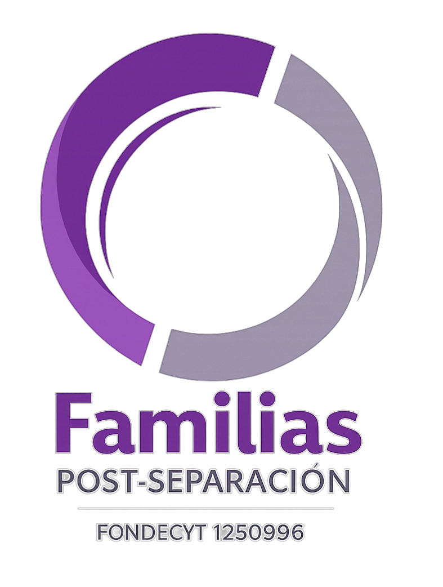
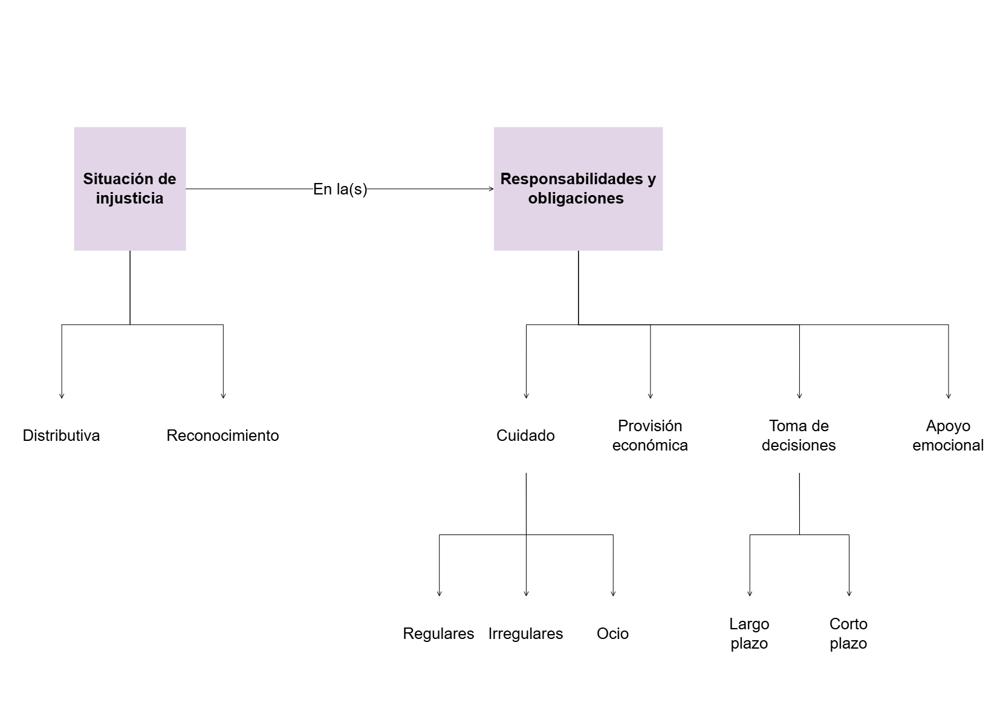
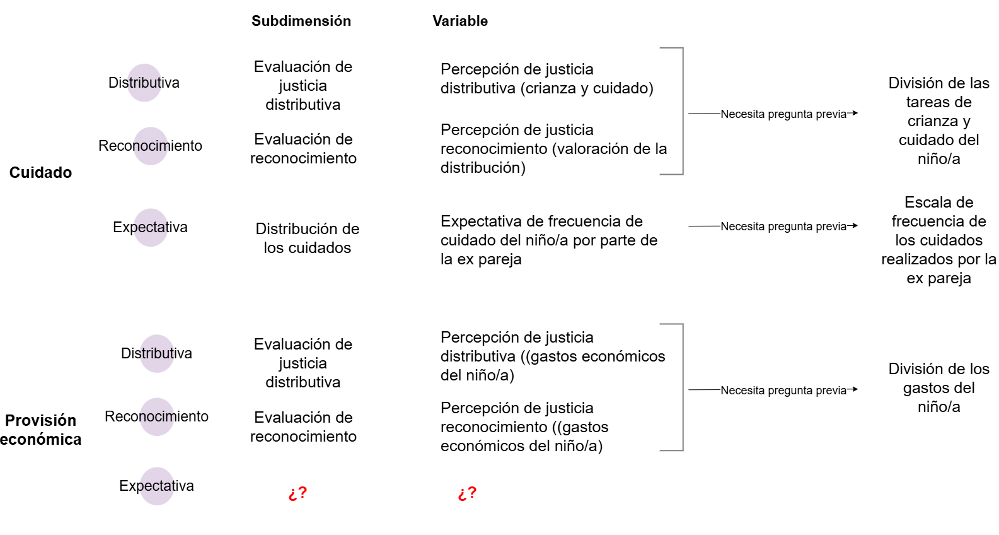
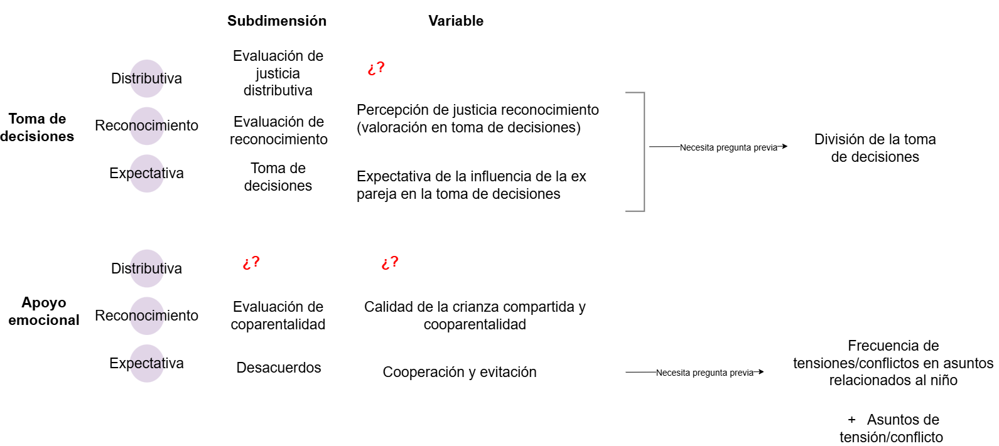

## 

:::: columns
::: {.column width="20%"}

:::

::: {.column .column-right width="80%"}  
 

# [**Preguntas   encuesta**]{.black}

------------------------------------------------------------------------

:::
::::

## 

:::: columns
::: {.column width="50%"}

### Situación de injusticia

- **Teóricamente**: Frustración de las expectativas normativas que son justificadas por los afectados.   

- **Operativamente**: 

  - Diferencia entre la contribución realizada por la ex pareja (en la división de responsabilidades) y la contribución esperada para sí misma, para su ex pareja o para ambos.
  - Si la persona considera que su contribución al cuidado y la crianza son menospreciados o no valorados por su ex pareja.

:::

::: {.column width="7%"}
:::

::: {.column width="38%"}
### Obligaciones y responsabilidades familiares

- **Teóricamente**: Obligaciones de cuidado, provisión económica, toma de decisiones y apoyo emocional.

- **Operativamente**: Frecuencia de las tareas de cuidado, provisión económica, toma de decisiones y apoyo emocional. 

:::
:::

## 

## [*Actitudes* frente a situaciones de injusticia en la vida familiar]{.black}

:::: columns
::: {.column width="45%"}

::: {.callout-note title="Definición operacional" icon=false}
*Injusticia distributiva*

Porcentaje en que la persona considera que la división del cuidado y la crianza es injusta (es decir, la contribución realizada es diferente a la esperada) para sí misma, para su ex pareja o para ambos. 

*Injusticia reconocimiento*

Porcentaje en que la persona considera que el cuidado y crianza realizados son menospreciados o no valorados por su ex pareja. 

:::
:::

::: {.column width="45%"}

::: {.callout-important title=Variables icon=false}

- Percepción de justicia distributiva (crianza y cuidado) 

- Percepción de justicia distributiva ((gastos económicos del niño/a) 

- Percepción de justicia reconocimiento (valoración de la distribución)

- Percepción de justicia reconocimiento ((gastos económicos del niño/a) 

- Percepción de justicia reconocimiento (valoración en toma de decisiones)  

:::
:::
:::

## [Variable compuesta]{.black}

::: {.callout-important title=Variables icon=false}
- Escala de frecuencia de los cuidados realizados por la ex pareja 

- Escala de frecuencia de los cuidados realizados por la persona encuestada 

- División de las tareas de crianza y cuidado del niño/a 

- División de la toma de decisiones 

:::

$$\text{Justicia} = \ln\left(\frac{\text{Cuidado percibido}}{\text{Cuidado esperado}}\right)$$
$$\text{Justicia} = \ln\left(\frac{\text{Influencia percibida}}{\text{Influencia esperada}}\right)$$

## [*Expectativas* respecto a las responsabilidades y obligaciones familiares]{.black}

:::: columns
::: {.column width="45%"}

::: {.callout-note title="Definición operacional" icon=false}

Frecuencia esperada de cuidado, provisión económica, toma de decisiones y apoyo emocional 
:::

:::

::: {.column width="45%"}

::: {.callout-important title="Variables" icon=false}

- Expectativa de frecuencia de cuidado del niño/a por parte de la ex pareja

- Expectativa de la influencia de la ex pareja en la toma de decisiones 

- Expectativas de apoyo emocional (cooperación y evitación)

:::
:::
:::

## [*Grado de aceptación* hacia las situaciones de injusticia familiar]{.black}

:::: columns
::: {.column width="60%"}

::: {.callout-note title="Definición operacional" icon=false}
Porcentaje de *satisfacción* con la distribución del cuidado, aun cuando esta distribución es inequitativa.

#### Variable compuesta: *distribución inequitativa del cuidado*

- ${\text{Contribución ex pareja}}>{\text{Contribución encuestado}}$

:::
:::

::: {.column width="30%"}

::: {.callout-important title="Variables" icon=false}
- Satisfacción con el cuidado del niño/a realizado por la ex pareja 

- División de las tareas de crianza y cuidado del niño/a 

- Escala de frecuencia de los cuidados realizados por la ex pareja 

- Escala de frecuencia de los cuidados realizados por la persona encuestada 

:::
:::

:::

## []{.black}

::: columns
::: {.column width="60%"}

::: {.callout-note title="Definición operacional" icon=false}
 Porcentaje en que una persona considera *justa* la distribución de cuidado con su ex pareja, aun cuando esta distribución es inequitativa.
 
#### Variable compuesta: *distribución inequitativa del cuidado*

- ${\text{Contribución ex pareja}}>{\text{Contribución encuestado}}$

:::
:::

::: {.column width="30%"}

::: {.callout-important title="Variables" icon=false}

- Percepción de justicia distributiva (crianza y cuidado) 

- División de las tareas de crianza y cuidado del niño/a 

- Escala de frecuencia de los cuidados realizados por la ex pareja 

- Escala de frecuencia de los cuidados realizados por la persona encuestada 

:::
:::
:::

## [*Grado de rechazo* hacia las situaciones de injusticia familiar]{.black}

:::: columns
::: {.column width="60%"}

::: {.callout-note title="Definición operacional" icon=false}
Porcentaje de *insatisfacción* con la distribución del cuidado, aun cuando esta distribución es inequitativa.

#### Variable compuesta: *distribución inequitativa del cuidado*

- ${\text{Contribución ex pareja}}>{\text{Contribución encuestado}}$

:::
:::

::: {.column width="30%"}

::: {.callout-important title="Variables" icon=false}
- Satisfacción con el cuidado del niño/a realizado por la ex pareja 

- División de las tareas de crianza y cuidado del niño/a 

- Escala de frecuencia de los cuidados realizados por la ex pareja 

- Escala de frecuencia de los cuidados realizados por la persona encuestada 
:::
:::
:::

## []{.black}

:::: columns
::: {.column width="60%"}

::: {.callout-note title="Definición operacional" icon=false}
Justicia: 
Porcentaje en que una persona considera *injusta* la distribución de cuidado con su ex pareja, aun cuando esta distribución es inequitativa.

#### Variable compuesta: *distribución inequitativa del cuidado*

- ${\text{Contribución ex pareja}}>{\text{Contribución encuestado}}$

:::
:::

::: {.column width="30%"}

::: {.callout-important title="Variables" icon=false}

- Percepción de justicia distributiva (crianza y cuidado) 

- División de las tareas de crianza y cuidado del niño/a 

- Escala de frecuencia de los cuidados realizados por la ex pareja 

- Escala de frecuencia de los cuidados realizados por la persona encuestada 

:::
:::
:::

## [Diferencias según *sociodemográficas*]{.black}

:::: columns
::: {.column width="28%"}

::: {.callout-important title="Variable" icon=false}

- Género 
:::
:::

::: {.column width="28%"}

::: {.callout-important title="Variable" icon=false}

- Tipo de unión

:::
:::

::: {.column width="40%"}

::: {.callout-important title="Variable" icon=false}
- Clase social 

  - Ingreso
  - Nivel educacional
  - Ocupación

:::
:::

::: 

## [Hasta ahora tenemos: *Parental care*]{.black}

## [Hasta ahora tenemos: *Parental authority*]{.black}

